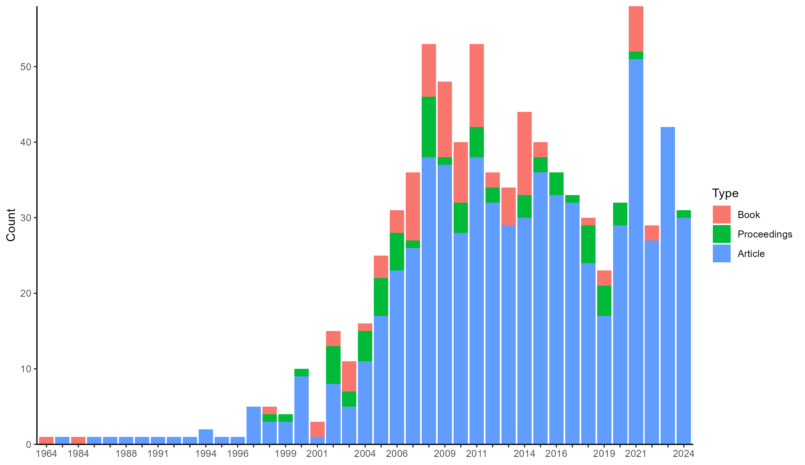
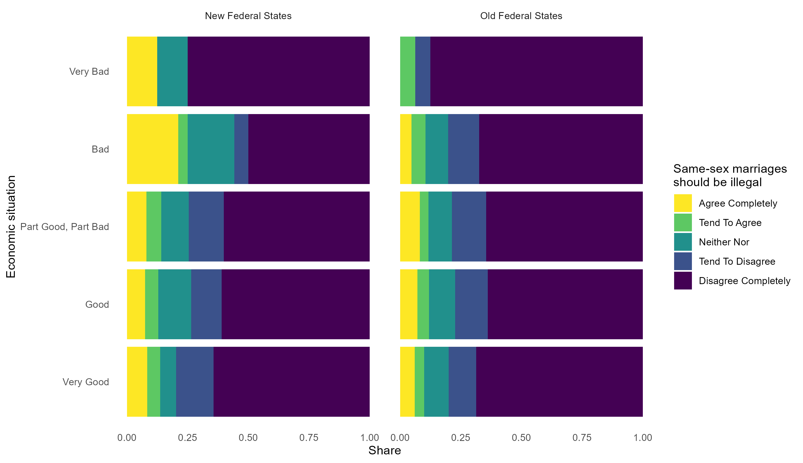

# Retrieve data from the GESIS archive

GESIS Search is a service by GESIS - Leibniz Institute for the Social
Sciences to look up information about research data, survey variables,
empirical instruments and tools, literature, and library collections
from the social sciences. `rgesis` is a package to query its search
engine to retrieve metadata on search records and to download survey
data from GESIS’ comprehensive data archive. It does so in a
reproducible manner that can easily be embedded in code files and
publications. The package mainly consists of three functions

1.  Authenticate a session using
    [`gesis_auth()`](https://jslth.github.io/rgesis/reference/gesis_auth.md)
2.  Search the GESIS catalogue using
    [`gesis_search()`](https://jslth.github.io/rgesis/reference/gesis_search.md)
3.  Retrieve data using
    [`gesis_data()`](https://jslth.github.io/rgesis/reference/gesis_data.md)

## Authentication

GESIS expects all users who wish to download a data file to be logged
in. The
[`gesis_auth()`](https://jslth.github.io/rgesis/reference/gesis_auth.md)
function takes over this task purely programmatically. You need to
provide the function with a user email and a password. The credentials
are used to login once and then stored in a secure
[keyring](https://keyring.r-lib.org/) storage. If you get a success
message, you are good to go.

``` r
gesis_auth(email = "jonas.lieth@gesis.org", password = "****")
# ✔ Successfully performed GESIS login.
```

You can also manually check the stored credentials by interacting with
the keyring.

``` r
keyring::key_list("rgesis")
#>   service              username
#> 1  rgesis jonas.lieth@gesis.org
```

## GESIS Search

Even without authentication, you can use `rgesis` to retrieve metadata
on GESIS search entries like datasets, variables, publications or tools.
This can be done using the
[`gesis_search()`](https://jslth.github.io/rgesis/reference/gesis_search.md)
function which offers tools for querying and filtering the GESIS search
engine. For example, to get metadata on the German General Social Survey
(ALLBUS) from 2018, you can do:

``` r
gesis_search(
  "allbus",
  type = "research_data",
  collection_year = c(2018, 2018)
)
#> A list of <gesis_records> with 10 records
#> <gesis_record>
#> Type: research_data
#> ID: ZA5272
#> Title: German General Social Survey - ALLBUS 2018
#> Date: 2019
#> Persons:
#> • Diekmann, Andreas
#> • Hadjar, Andreas
#> • Kurz, Karin
#> • ... and 3 more
#> 
#> <gesis_record>
#> Type: research_data
#> ID: ZA5270
#> Title: Allgemeine Bevölkerungsumfrage der Sozialwissenschaften ALLBUS 2018
#> Date: 2019
#> Persons:
#> • Diekmann, Andreas
#> • Hadjar, Andreas
#> • Kurz, Karin
#> • ... and 3 more
#> 
#> <gesis_record>
#> Type: research_data
#> ID: ZA5260
#> Title: Allgemeine Bevölkerungsumfrage der Sozialwissenschaften - ALLBUS
#> Sensitive Regionaldaten
#> Date: 2021
#> Persons:
#> • Allerbeck, Klaus
#> • Allmendinger, Jutta
#> • Andreß, Hans-Jürgen
#> • ... and 23 more
#> # ℹ 7 more records
#> # ℹ Use `print(n = ...)` to see more records
```

`"allbus"` is the query string, `"research_data"` is the result type
(you can also search for other types like publications or tools), and
`c(2018, 2018)` is the time in which the queried dataset must be
collected.

If you need this data in a more workable manner, you can set
`tidy = TRUE`. This will convert the metadata to a pretty dataframe. Be
aware that not all metadata fields can be fit in a rectangular shape and
must be dropped. If completeness of metadata records is a priority, you
should leave the output untidy.

``` r
gesis_search(
  "allbus",
  type = "research_data",
  collection_year = c(2018, 2018),
  tidy = TRUE
)
#> # A tibble: 10 × 106
#>    id     title     type  date  study_title date_recency study_number portal_url
#>    <chr>  <chr>     <chr> <chr> <chr>       <chr>        <chr>        <chr>     
#>  1 ZA5272 German G… rese… 2019  German Gen… 2018         ZA5272       https://d…
#>  2 ZA5270 Allgemei… rese… 2019  Allgemeine… 2018         ZA5270       https://d…
#>  3 ZA5260 Allgemei… rese… 2021  Allgemeine… 2018         ZA5260       https://d…
#>  4 ZA5274 Allgemei… rese… 2021  Allgemeine… 2018         ZA5274       https://d…
#>  5 ZA5276 German G… rese… 2021  German Gen… 2018         ZA5276       https://d…
#>  6 ZA5262 Allgemei… rese… 2021  Allgemeine… 2018         ZA5262       https://d…
#>  7 ZA5273 German G… rese… 2019  German Gen… 2018         ZA5273       https://d…
#>  8 ZA5277 German G… rese… 2021  German Gen… 2018         ZA5277       https://d…
#>  9 ZA5271 Allgemei… rese… 2019  Allgemeine… 2018         ZA5271       https://d…
#> 10 ZA5275 Allgemei… rese… 2021  Allgemeine… 2018         ZA5275       https://d…
#> # ℹ 98 more variables: person_sort <chr>,
#> #   primary_researchers_advisory_board_institution <list>, subtype <chr>,
#> #   abstract <chr>, source <chr>, time_collection <chr>,
#> #   time_collection_max_year <chr>, time_collection_min_year <chr>,
#> #   time_collection_years <list>, countries_collection <chr>,
#> #   countries_iso <chr>, countries_free <chr>, countries_view <chr>,
#> #   methodology_collection <chr>, analysis_system <chr>, …
```

While the first 10 results are enough for many use cases, sometimes you
just need more than that. By default,
[`gesis_search()`](https://jslth.github.io/rgesis/reference/gesis_search.md)
only requests the first search page. You can choose which pages to
request by setting the `pages` argument. You can even request all pages
by setting it to `NULL`.

``` r
gesis_search(
  "allbus",
  type = "research_data",
  collection_year = c(2018, 2018),
  tidy = TRUE,
  pages = NULL
)
#> ⠙ iterating 3 done (1.3/s) | 2.3s
#> # A tibble: 13 × 123
#>    id         title type  date  study_title date_recency study_number portal_url
#>    <chr>      <chr> <chr> <chr> <chr>       <chr>        <chr>        <chr>     
#>  1 ZA5272     Germ… rese… 2019  German Gen… 2018         ZA5272       https://d…
#>  2 ZA5270     Allg… rese… 2019  Allgemeine… 2018         ZA5270       https://d…
#>  3 ZA5260     Allg… rese… 2021  Allgemeine… 2018         ZA5260       https://d…
#>  4 ZA5274     Allg… rese… 2021  Allgemeine… 2018         ZA5274       https://d…
#>  5 ZA5276     Germ… rese… 2021  German Gen… 2018         ZA5276       https://d…
#>  6 ZA5262     Allg… rese… 2021  Allgemeine… 2018         ZA5262       https://d…
#>  7 ZA5273     Germ… rese… 2019  German Gen… 2018         ZA5273       https://d…
#>  8 ZA5277     Germ… rese… 2021  German Gen… 2018         ZA5277       https://d…
#>  9 ZA5271     Allg… rese… 2019  Allgemeine… 2018         ZA5271       https://d…
#> 10 ZA5275     Allg… rese… 2021  Allgemeine… 2018         ZA5275       https://d…
#> 11 SDN-10.78… Harm… rese… 2021  Harmonizin… 2021         NA           https://d…
#> 12 SDN-10.78… Harm… rese… 2021  Harmonizin… 2021         NA           https://d…
#> 13 SDN-10.78… Harm… rese… 2021  Harmonizin… 2021         NA           https://d…
#> # ℹ 115 more variables: person_sort <chr>,
#> #   primary_researchers_advisory_board_institution <list>, subtype <chr>,
#> #   abstract <chr>, source <chr>, time_collection <chr>,
#> #   time_collection_max_year <chr>, time_collection_min_year <chr>,
#> #   time_collection_years <list>, countries_collection <list>,
#> #   countries_iso <chr>, countries_free <chr>, countries_view <chr>,
#> #   methodology_collection <chr>, analysis_system <chr>, …
```

To exemplify, we can perform a very basic bibliographic analysis of the
evolution of climate change literature based on the most relevant 5000
records in the GESIS archive.

``` r
cc <- gesis_search(
  "climate change",
  type = "publication",
  pages = 1:500,
  tidy = TRUE
)

library(ggplot2)
ggplot(na.omit(cc[c("date", "subtype")])) +
  geom_bar(aes(x = date, fill = subtype)) +
  scale_y_continuous(expand = c(0, 0)) +
  scale_fill_discrete("Type", labels = c(
    book = "Book",
    in_proceedings = "Proceedings",
    journal_article = "Article"
  )) +
  guides(x = guide_axis(check.overlap = TRUE)) +
  labs(x = NULL, y = "Count") +
  theme_classic()
```



Finally, if you already know a dataset or record you want to look up,
you can use the
[`gesis_get()`](https://jslth.github.io/rgesis/reference/gesis_get.md)
function to search for a specific record ID. These IDs can be retrieved
from the metadata records returned by
[`gesis_search()`](https://jslth.github.io/rgesis/reference/gesis_search.md).

``` r
allbus <- gesis_get("ZA5272")
allbus
#> <gesis_record>
#> Type: research_data
#> ID: ZA5272
#> Title: German General Social Survey - ALLBUS 2018
#> Date: 2019
#> Persons:
#> • Diekmann, Andreas
#> • Hadjar, Andreas
#> • Kurz, Karin
#> • ... and 3 more
```

## Data retrieval

Both of the last two steps ultimately help to retrieve survey data from
the GESIS data archive. First, authentication is needed to be allowed to
download in the first place. Second, a metadata record (or at least a
record ID) is needed to specify what dataset you want to download.
Finally, it is often a good idea to first explore what kinds of data are
in store for a given record. The
[`gesis_file_types()`](https://jslth.github.io/rgesis/reference/gesis_files.md)
function gives insights into the types of data available.

``` r
gesis_file_types(allbus)
#> [1] "dataset"       "questionnaire" "codebook"
```

Now we know that the ALLBUS record contains dataset files. But which
files are available exactly?

``` r
gesis_files(allbus, type = "dataset")
#> <gesis_files>
#> → File 1
#> Label: ZA5272_v1-0-0.dta.zip
#> File size: 0.94 MB
#> Login required? yes
#> ────
#> → File 2
#> Label: ZA5272_v1-0-0.sav.zip
#> File size: 1.02 MB
#> Login required? yes
```

Using this information, we can download the .sav file to disk using the
[`gesis_data()`](https://jslth.github.io/rgesis/reference/gesis_data.md)
function.

``` r
path <- gesis_data(allbus, select = "\\.sav")
```

Since GESIS files can come in all kinds of file formats, the package
leaves reading the data to the user. In this case, we can use the
[haven](https://haven.tidyverse.org/) package to read the downloaded
file.

``` r
library(dplyr)
library(stringr)
library(haven)
allbus_data <- read_sav(path)

allbus_data <- allbus_data |>
  select(eastwest, economic_situation = ep01, samesex_marriage = pa12) |>
  mutate(across(everything(), .fns = ~as_factor(.x))) |>
  mutate(eastwest = str_to_title(eastwest)) |>
  select(economic_situation, samesex_marriage, eastwest) |>
  na.omit()

ggplot(allbus_data, aes(economic_situation)) +
  geom_bar(
    aes(fill = samesex_marriage),
    position = position_fill(reverse = TRUE)
  ) +
  facet_wrap(~eastwest) +
  scale_fill_viridis_d(
    name = "Same-sex marriages\nshould be illegal",
    labels = str_to_title,
    direction = -1
  ) +
  scale_x_discrete(labels = str_to_title) +
  coord_flip() +
  theme_minimal() +
  labs(x = "Economic situation", y = "Share") +
  theme(panel.grid = element_blank())
```


